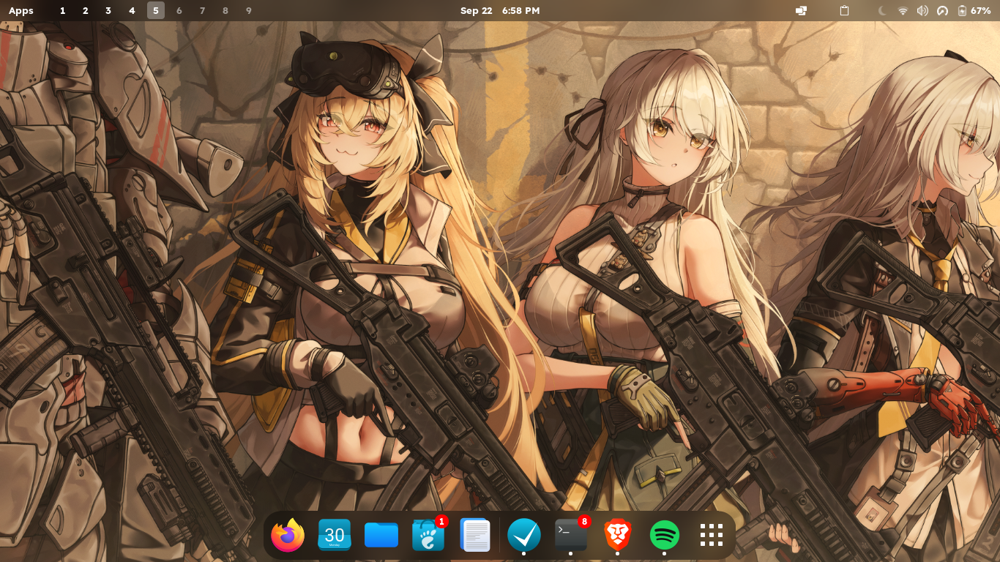

# zoecyber-dotfiles

**GNOME + Pop Shell + Material You** — a keyboard-driven, dynamically themed Fedora desktop that feels like Hyprland but runs on the stability of GNOME Wayland.

<p align="center">
  
</p>

---

## What Is This?

A complete desktop rice for **Fedora 44+ / GNOME Shell 50+** that transforms stock GNOME into a tiling, glassmorphic, dynamically-colored workspace — with zero manual configuration.

Every time you change your wallpaper, the **entire desktop** re-themes itself:
- GTK 3 & Libadwaita (GTK 4) window chrome
- Kitty terminal colors
- Ulauncher spotlight bar
- Pop Shell active window borders
- Space-Bar workspace indicator pills
- GNOME accent color

All powered by **Google Material You (Material 3)** color extraction via [Matugen](https://github.com/InioX/matugen).

---

## Architecture

```
Wallpaper ──▶ Matugen (Material 3 Engine)
                  │
                  ├──▶ GTK 3 / Libadwaita CSS variables
                  ├──▶ Kitty terminal (16-color ANSI palette)
                  ├──▶ Pop Shell active border (hint-color-rgba)
                  ├──▶ Space-Bar workspace pills (dconf CSS injection)
                  ├──▶ Ulauncher theme.css (@define-color tokens)
                  └──▶ GNOME accent-color (closest native match)
```

### Stack

| Component | Technology | Role |
| :--- | :--- | :--- |
| **Window Manager** | Pop Shell | Auto-tiling with smart gaps, vim navigation (`Super+hjkl`), stacking |
| **Design Language** | Material You (M3) | Dynamic palette extraction from wallpaper |
| **Top Panel** | Aylur Floating Panel + Space-Bar + Blur my Shell | Frosted glass island with numbered workspace pills |
| **Launcher** | Ulauncher (`Alt+Space`) | Spotlight-style floating search bar |
| **Terminal** | Kitty (`Super+Enter`) | Borderless, 85% opacity, Monaspace Neon font |
| **Wallpaper Studio** | Custom GTK 4 / Libadwaita app (`Super+w`) | Visual gallery with Wallhaven + yande.re batch fetch |
| **App Drawer** | Custom GTK 3 Layer Shell overlay (`Super+a`) | Full-screen searchable application grid |
| **Window FX** | Burn My Windows | Shader-based open/close animations |
| **Shell Prompt** | Oh My Posh (Zen theme) + Fish shell | Minimalist 3-line prompt with git status |

---

## Keyboard Shortcuts

| Shortcut | Action |
| :--- | :--- |
| `Alt+Space` | Ulauncher (spotlight launcher) |
| `Super+Return` | Kitty terminal |
| `Super+b` | Brave Browser |
| `Super+c` | VS Code |
| `Super+e` | Nautilus Files |
| `Super+w` | Wallpaper Studio |
| `Super+a` | App Drawer (Launchpad) |
| `Super+q` | Close window |
| `Super+m` / `Super+z` | Toggle maximize |
| `Super+f` | Toggle fullscreen |
| `Super+h/j/k/l` | Navigate tiled windows (vim-style) |
| `Super+Shift+h/j/k/l` | Move window to monitor |
| `Super+1..9` | Switch workspace |
| `Super+Shift+1..9` | Move window to workspace |
| `Super+s` | Stack windows (tabbed group) |
| `Super+y` | Toggle tiling |
| `Super+Shift+f` | Toggle floating |
| `Ctrl+Super+t` | Random Material You wallpaper |
| `Ctrl+Super+w` | Fetch online wallpaper |
| `Super+Shift+s` | Screenshot |
| `Super+l` | Lock screen |

---

## Installation

### Requirements

- **Fedora 44+** (Workstation Edition recommended)
- **GNOME Shell 46+** (tested on 50.3)
- Internet connection (for packages, fonts, extensions)

### Quick Install

```bash
git clone https://github.com/zoecyber/zoecyber-dotfiles.git ~/.dotfiles
cd ~/.dotfiles
chmod +x install.sh uninstall.sh
./install.sh
```

The installer is **idempotent** — safe to re-run. It will:

1. **Back up** all existing configs to `~/.dotfiles-backup/<timestamp>/`
2. Install system packages via `dnf` (kitty, fish, matugen, starship, eza, bat, etc.)
3. Install GNOME Shell extensions
4. Symlink config files (kitty, ulauncher, pop-shell, matugen, fish, etc.)
5. Install custom scripts to `~/.local/bin/`
6. Set up systemd user services (Ulauncher auto-start, Matugen wallpaper watcher)
7. Patch Ulauncher for Pop Shell floating compatibility
8. Load all GNOME/dconf extension settings
9. Apply keyboard shortcuts
10. Generate initial Material You theme from current wallpaper

### Options

```bash
./install.sh --dry-run          # Preview without modifying anything
./install.sh --skip-dnf         # Skip package installation (non-Fedora)
./install.sh --skip-extensions  # Skip GNOME extension installation
./install.sh --uninstall        # Remove and restore backups
```

### Uninstall

```bash
./uninstall.sh
```

Removes all symlinks, disables services, and restores your backed-up configs.

---

## File Structure

```
zoecyber-dotfiles/
├── install.sh                          # Main installer (9 phases)
├── uninstall.sh                        # Clean removal & backup restore
├── config/
│   ├── kitty/                          # Terminal config + Material You theme
│   ├── ulauncher/                      # Settings + Material You theme CSS
│   ├── pop-shell/                      # Float rules (Ulauncher, Wallpaper Studio)
│   ├── matugen/                        # Color engine config + GTK/Kitty/Ulauncher templates
│   ├── fish/                           # Fish shell config
│   ├── ohmyposh/                       # Zen prompt theme
│   ├── gtk-3.0/ & gtk-4.0/            # GTK settings (dark mode, icons, cursor, fonts)
│   └── systemd/user/                   # Ulauncher + Matugen watcher services
├── scripts/
│   ├── matugen-gnome                   # Material You pipeline bridge
│   ├── fetch-wallpaper                 # Wallhaven + yande.re scraper
│   ├── wallpaper-picker                # GTK 4 wallpaper gallery studio
│   └── launchpad.py                    # Full-screen app drawer
├── keybinds/
│   └── apply_keybinds.sh              # All GNOME keyboard shortcuts
├── dconf/                              # Exported GNOME extension settings
│   ├── pop-shell.dconf
│   ├── space-bar.dconf
│   ├── blur-my-shell.dconf
│   ├── just-perfection.dconf
│   ├── floating-panel.dconf
│   ├── burn-my-windows.dconf
│   ├── dash-to-dock.dconf
│   ├── desktop-interface.dconf
│   ├── desktop-wm.dconf
│   └── mutter.dconf
├── patches/
│   └── ulauncher-popshell-float.py    # Ulauncher + Pop Shell tiling fix
└── assets/
    └── preview.png                     # Desktop screenshot
```

---

## How The Theming Pipeline Works

1. **Wallpaper changes** (via Wallpaper Studio, `Ctrl+Super+t`, or any method)
2. **Matugen watcher daemon** (`matugen-gnome --watch`) detects the change
3. **Matugen** extracts a Material 3 tonal palette from the wallpaper image
4. **Templates** are rendered with the new colors:
   - `gtk-3.0/gtk.css` — CSS custom properties for GTK 3 apps
   - `gtk-4.0/gtk.css` — Libadwaita `@define-color` tokens (light + dark)
   - `kitty/current-theme.conf` — Terminal ANSI colors
   - `ulauncher/theme.css` — Launcher accent and surface colors
5. **`matugen-gnome`** additionally:
   - Sets GNOME's native `accent-color` to the closest match
   - Updates Pop Shell's `hint-color-rgba` for window borders
   - Injects dynamic CSS into Space-Bar's workspace pills via dconf
   - Sends `SIGUSR1` to Kitty for live color reload
   - Sends `SIGHUP` to Ulauncher for theme refresh

---

## Credits

- [Pop Shell](https://github.com/pop-os/shell) — Tiling engine
- [Matugen](https://github.com/InioX/matugen) — Material You color extraction
- [Ulauncher](https://ulauncher.io/) — Application launcher
- [Kitty](https://sw.kovidgoyal.net/kitty/) — GPU-accelerated terminal
- [Oh My Posh](https://ohmyposh.dev/) — Shell prompt engine
- [Monaspace](https://monaspace.githubnext.com/) — Monospace font family
- [Kora Icons](https://github.com/bikass/kora) — Icon theme
- [Bibata Cursors](https://github.com/ful1e5/Bibata_Cursor) — Cursor theme

---

## License

MIT — do whatever you want with it.
